# Tokamak DAO V1 Contract Architecture

## 1. 전체 시스템 구조

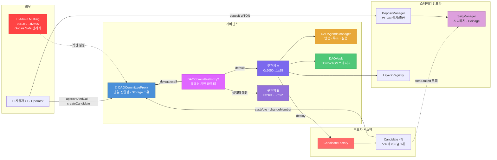

## 2. Proxy 구조

V1은 **Custom Transparent Proxy** 패턴을 사용합니다. EIP-1967이 아닌 일반 storage 변수에 구현체 주소를 저장합니다.

> **현재 상태 (2025년 이후)**: `DAOCommitteeProxy`의 `_implementation`이 `DAOCommitteeProxy2`로 업그레이드되었습니다. `DAOCommitteeProxy2`는 셀렉터(selector) 기반 멀티 구현체 라우터로, 호출되는 함수에 따라 서로 다른 구현체로 분기합니다.

### 2-1. Proxy 호출 흐름 (현재)

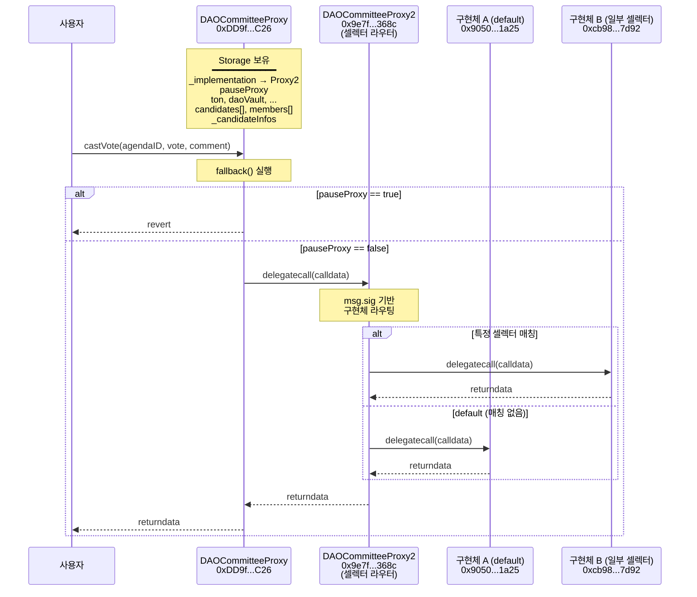

### 2-2. Proxy Storage Layout

Proxy와 구현체가 **동일한 Storage Layout**을 공유해야 합니다. `StorageStateCommittee`를 양쪽이 상속하여 이를 보장합니다.

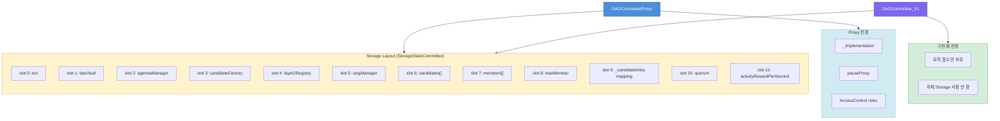

### 2-3. Proxy 업그레이드 이력

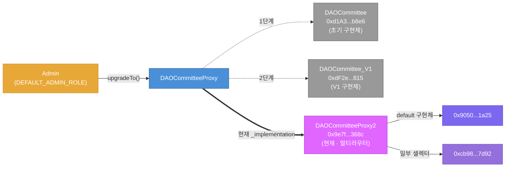

### 2-4. 다중 Proxy 구조

V1에는 3개의 Proxy 패턴이 존재합니다. DAOCommittee 측은 2단 delegatecall 구조(Proxy → Proxy2 → 구현체)입니다:

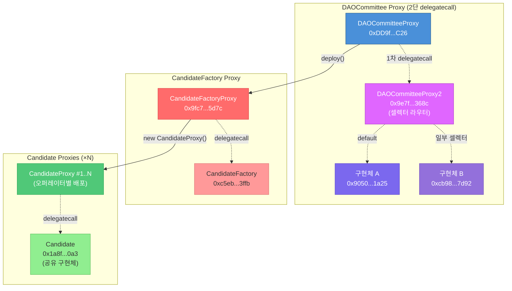

> **특이사항**: EIP-1967 표준 슬롯이 아닌 일반 `address internal _implementation` 변수를 사용합니다. 이로 인해 Etherscan 등의 도구에서 자동 구현체 감지가 되지 않을 수 있습니다.
>
> **DAOCommitteeProxy2**: Solidity v0.8.19로 작성된 셀렉터 기반 멀티 구현체 프록시입니다. `getSelectorImplementation2(bytes4)` 함수로 특정 셀렉터에 매핑된 구현체를 조회할 수 있으며, 매핑되지 않은 셀렉터는 default 구현체(`0x9050...1a25`)로 라우팅됩니다.

## 3. 상속 구조

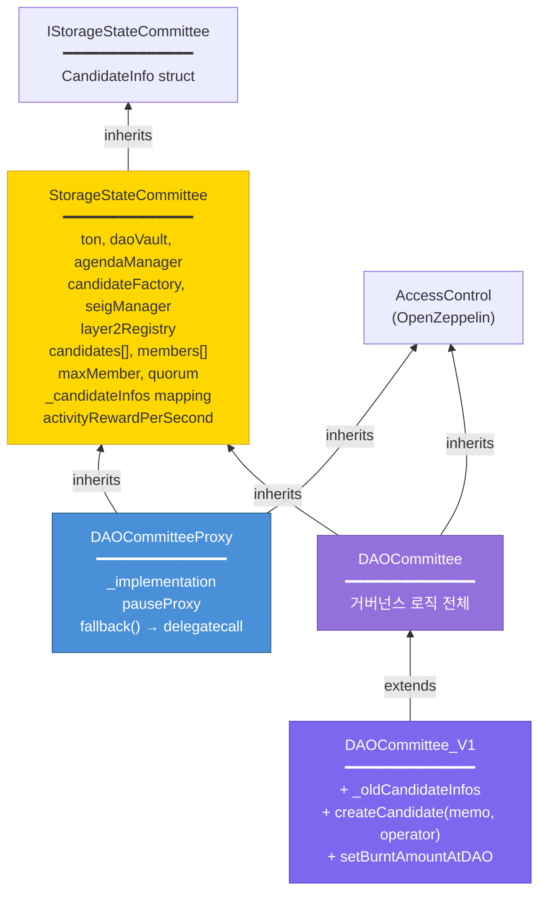

## 4. 안건(Agenda) 라이프사이클

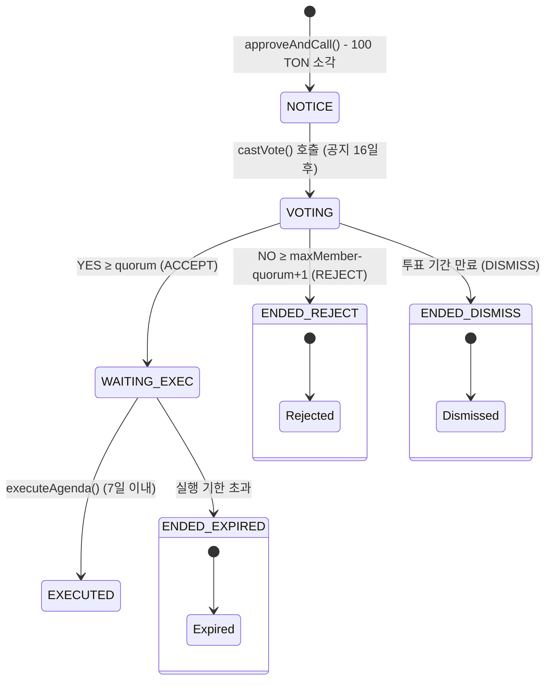

## 5. 스테이킹 → 거버넌스 연결

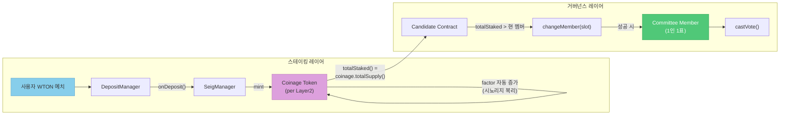

## 6. 안건 생성 상세 흐름

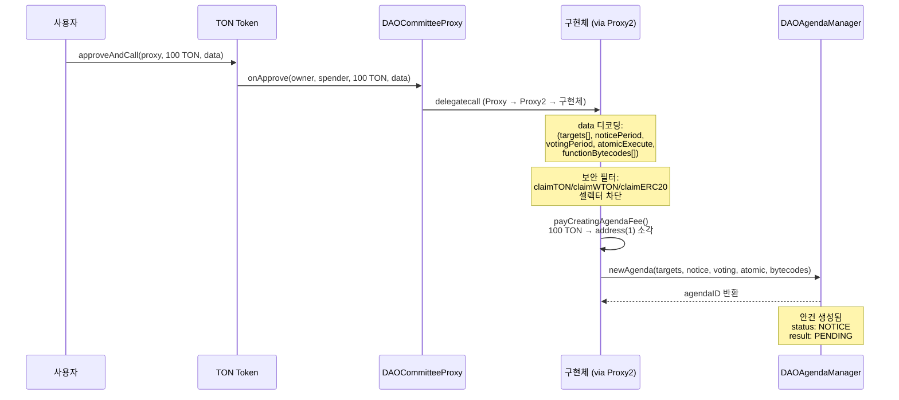

## 7. 투표 → 실행 상세 흐름

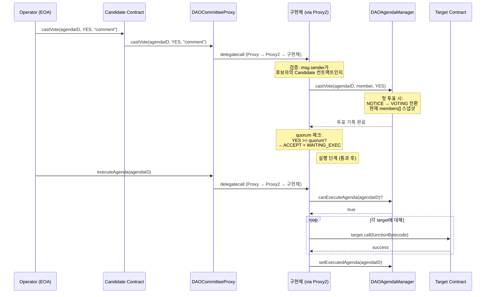

## 8. 핵심 데이터 구조

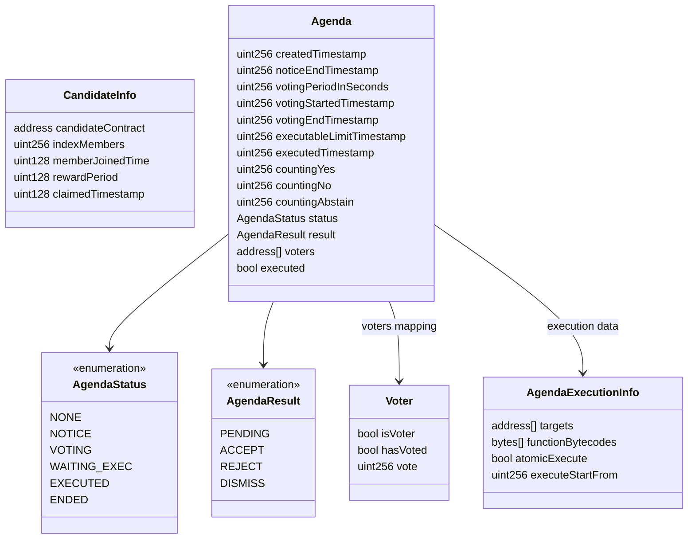

## 9. 메인넷 배포 주소 요약

| 컨트랙트 | 주소 | 역할 |
|---------|------|------|
| **DAOCommitteeProxy** | `0xDD9f0cCc044B0781289Ee318e5971b0139602C26` | 프록시 (진입점) |
| **DAOCommitteeProxy2** | `0x9e7f54eff4a4d35097e0acb6994a723f1a28368c` | 셀렉터 기반 멀티 구현체 라우터 (현재 `_implementation`) |
| ↳ 구현체 A (default) | `0x9050af1638f379a018737880ad946cdda9101a25` | Proxy2 default 구현체 |
| ↳ 구현체 B (일부 셀렉터) | `0xcb9859dc0fbeca68efff2bce289150513fdf7d92` | Proxy2 셀렉터 매칭 구현체 |
| **DAOCommittee** | `0xd1A3fDDCCD09ceBcFCc7845dDba666B7B8e6D1fb` | 이전 구현체 (초기) |
| **DAOCommittee_V1** | `0xdF2eCda32970DB7dB3428FC12Bc1697098418815` | 이전 구현체 (V1) |
| **DAOAgendaManager** | `0xcD4421d082752f363E1687544a09d5112cD4f484` | 안건 관리 |
| **DAOVault** | `0x2520CD65BAa2cEEe9E6Ad6EBD3F45490C42dd303` | 트레저리 |
| **CandidateFactory** | `0xc5eb1c5ce7196bdb49ea7500ca18a1b9f1fa3ffb` | 후보자 배포 |
| **CandidateFactoryProxy** | `0x9fc7100a16407ee24a79c834a56e6eca555a5d7c` | 팩토리 프록시 |
| **DAOCommitteeOwner** (이전) | `0xe070fFD0E25801392108076ed5291fA9524c3f44` | 이전 관리자 (현재 `DEFAULT_ADMIN_ROLE` 미보유) |
| **Admin Multisig** (현재) | `0xE3F72E959834d0A72aFb2ea79F5ec2b4243d2d95` | Gnosis Safe 멀티시그 (`DEFAULT_ADMIN_ROLE` 보유) |
| **Candidate** (impl) | `0x1a8f59017e0434efc27e89640ac4b7d7d194c0a3` | 후보자 구현체 |
| **SeigManager** | `0x0b55a0f463b6defb81c6063973763951712d0e5f` | 시뇨리지 (온체인 현재값) |
| **Layer2Registry** | `0x7846c2248a7b4de77e9c2bae7fbb93bfc286837b` | L2 등록소 (온체인 현재값) |
| **TON** | `0x2be5e8c109e2197D077D13A82dAead6a9b3433C5` | 네이티브 토큰 |
| **WTON** | `0xc4A11aaf6ea915Ed7Ac194161d2fC9384F15bff2` | Wrapped TON |

> **Storage 값 변경 이력**: `layer2Registry` (slot 4)와 `seigManager` (slot 5)의 값이 원래 배포 시점과 다릅니다. 이는 온체인 업그레이드(agenda 실행)를 통해 변경된 것으로 추정됩니다.
> - `layer2Registry`: `0x0b3E...063e` → `0x7846...837b`
> - `seigManager`: `0x7109...0909` → `0x0b55...0e5f`
>
> **Admin 변경 이력**: `DEFAULT_ADMIN_ROLE`이 `DAOCommitteeOwner`(`0xe070...3f44`)에서 Gnosis Safe 멀티시그(`0xE3F7...d2d95`, 소유자 3명)로 이전되었습니다. 현재 `DEFAULT_ADMIN_ROLE` 보유자는 해당 멀티시그과 DAOCommitteeProxy 자신(`0xDD9f...C26`) 2개입니다.
