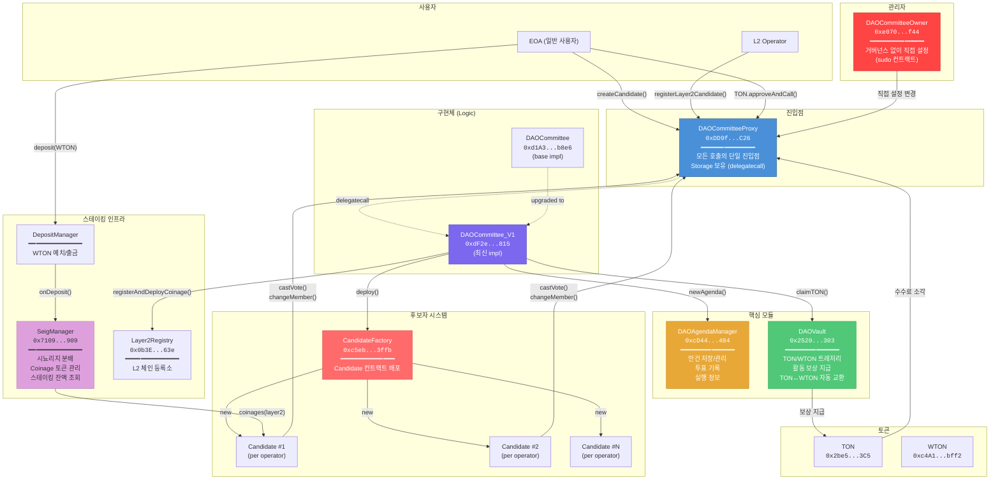
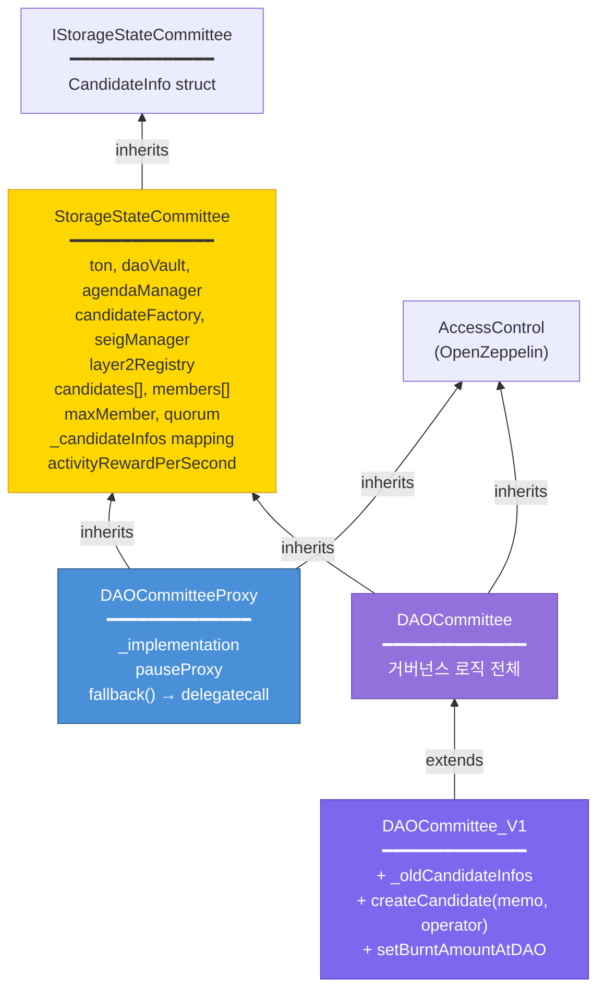
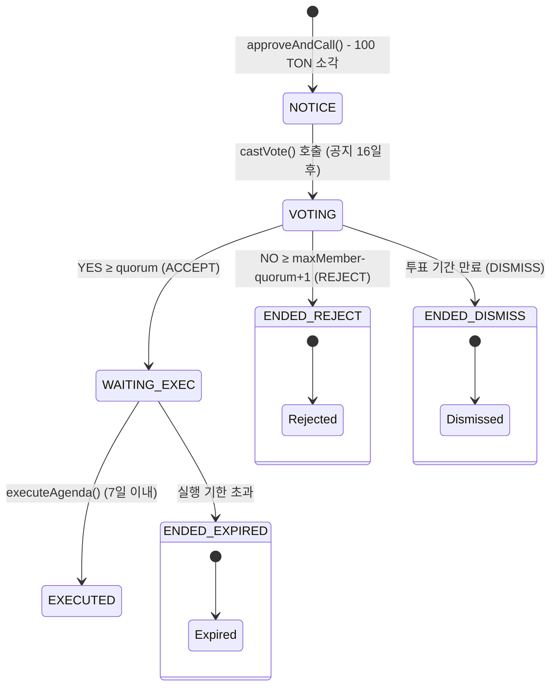
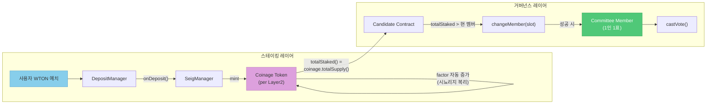
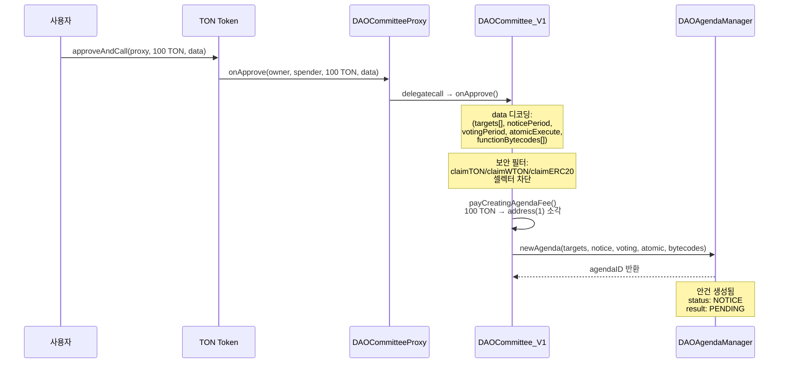
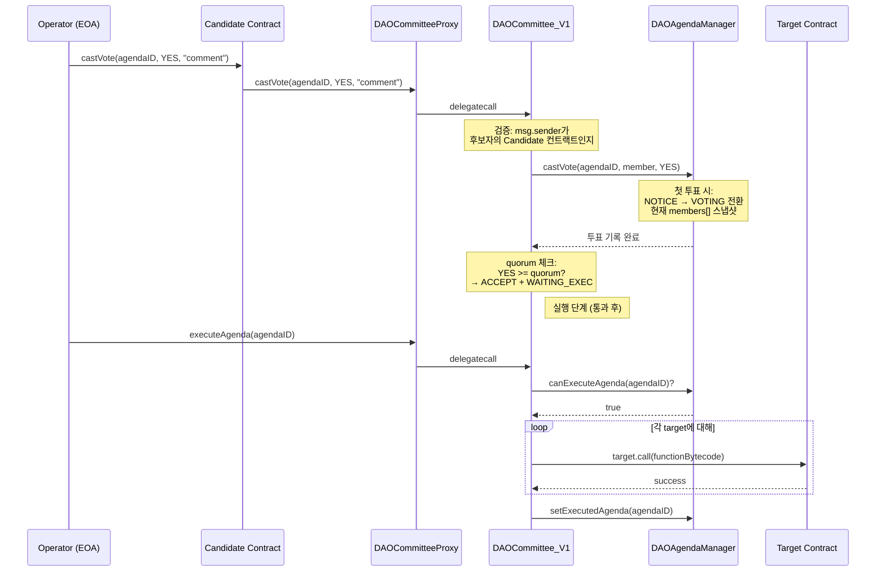
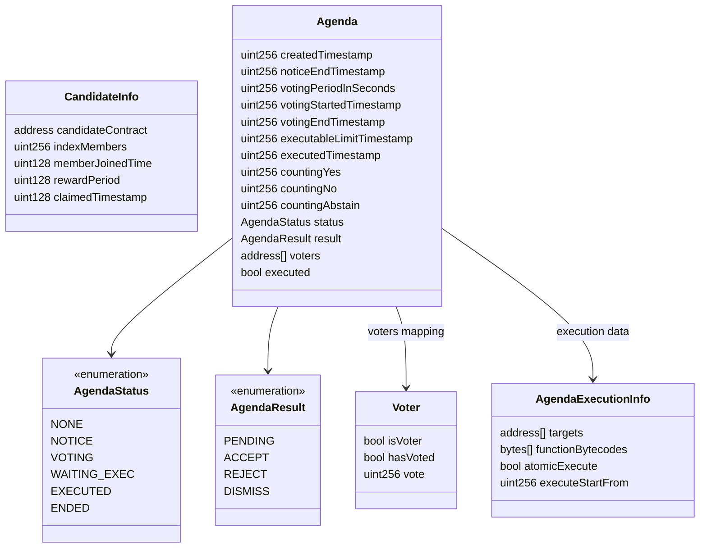

# Tokamak DAO V1 Contract Architecture

## 1. 전체 시스템 구조

## 2. 상속 구조

## 3. 안건(Agenda) 라이프사이클

## 4. 스테이킹 → 거버넌스 연결

## 5. 안건 생성 상세 흐름

## 6. 투표 → 실행 상세 흐름

## 7. 핵심 데이터 구조

## 8. 메인넷 배포 주소 요약

| 컨트랙트 | 주소 | 역할 |
|---------|------|------|
| **DAOCommitteeProxy** | `0xDD9f0cCc044B0781289Ee318e5971b0139602C26` | 프록시 (진입점) |
| **DAOCommittee** | `0xd1A3fDDCCD09ceBcFCc7845dDba666B7B8e6D1fb` | 기본 구현체 |
| **DAOCommittee_V1** | `0xdF2eCda32970DB7dB3428FC12Bc1697098418815` | 최신 구현체 |
| **DAOAgendaManager** | `0xcD4421d082752f363E1687544a09d5112cD4f484` | 안건 관리 |
| **DAOVault** | `0x2520CD65BAa2cEEe9E6Ad6EBD3F45490C42dd303` | 트레저리 |
| **CandidateFactory** | `0xc5eb1c5ce7196bdb49ea7500ca18a1b9f1fa3ffb` | 후보자 배포 |
| **CandidateFactoryProxy** | `0x9fc7100a16407ee24a79c834a56e6eca555a5d7c` | 팩토리 프록시 |
| **DAOCommitteeOwner** | `0xe070fFD0E25801392108076ed5291fA9524c3f44` | 관리자 (sudo) |
| **Candidate** (impl) | `0x1a8f59017e0434efc27e89640ac4b7d7d194c0a3` | 후보자 구현체 |
| **SeigManager** | `0x710936500aC59e8551331871Cbad3D33d5e0D909` | 시뇨리지 |
| **Layer2Registry** | `0x0b3E174A2170083e770D5d4Cf56774D221b7063e` | L2 등록소 |
| **TON** | `0x2be5e8c109e2197D077D13A82dAead6a9b3433C5` | 네이티브 토큰 |
| **WTON** | `0xc4A11aaf6ea915Ed7Ac194161d2fC9384F15bff2` | Wrapped TON |
